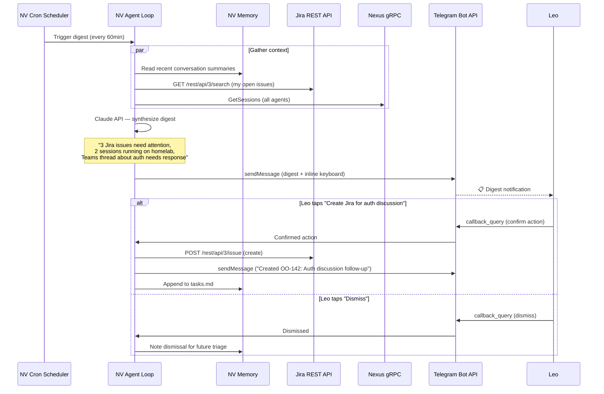
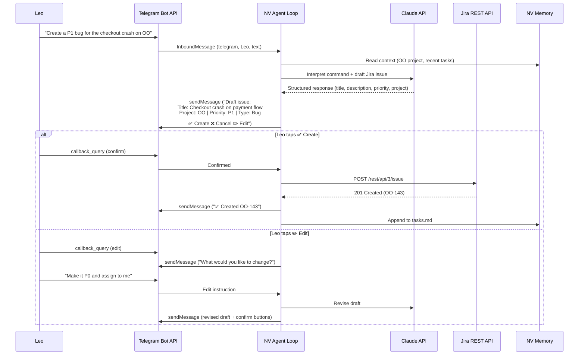
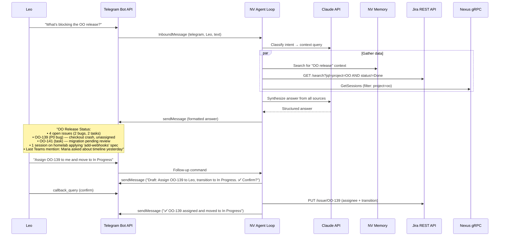
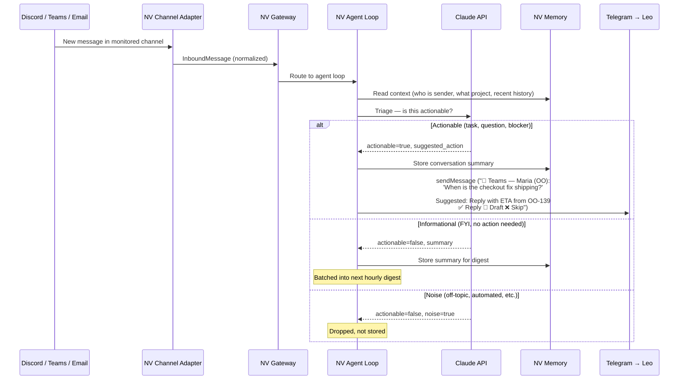
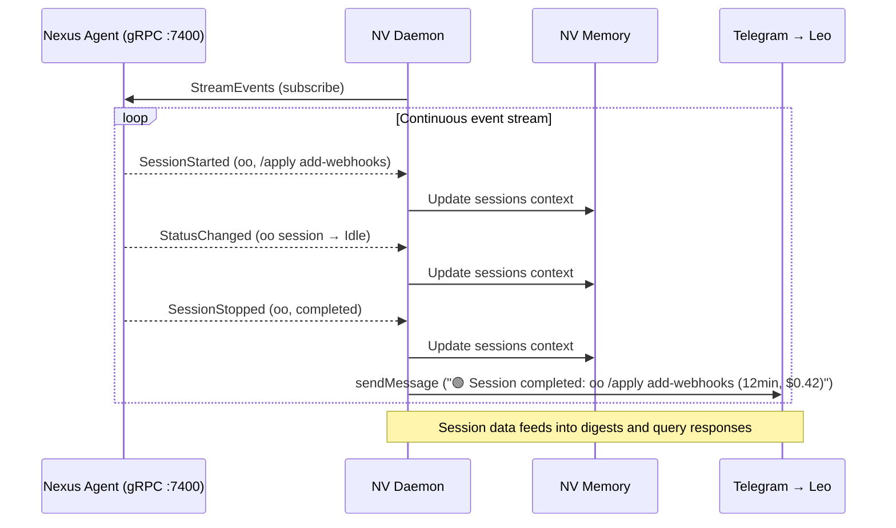

# User Stories — NV (Master Agent Harness)

## Personas

NV is single-user (Leo only), but Leo interacts with NV in 3 distinct modes:

### 1. Leo as Commander

| Field | Value |
|-------|-------|
| **Role** | Solo operator issuing direct commands |
| **Goals** | Create Jira issues from phone, transition task status, trigger scans on demand |
| **Pain Points** | Opening Jira app is slow; context-switching from mobile to laptop to manage tasks; forgetting to create issues for things discussed in chat |
| **Technical Comfort** | Power user |

**Key interaction:** Leo messages NV on Telegram → NV understands intent → drafts action → Leo taps confirm.

### 2. Leo as Consumer

| Field | Value |
|-------|-------|
| **Role** | Passive recipient of proactive intelligence |
| **Goals** | Stay informed without checking 6 different apps; know what needs attention before it becomes urgent; morning briefing of overnight activity |
| **Pain Points** | Missing important messages across Discord/Teams/email; tasks falling through cracks; no unified view of "what happened while I was away" |
| **Technical Comfort** | Power user |

**Key interaction:** NV sends periodic digest → Leo reads → taps to approve/dismiss suggested actions.

### 3. Leo as Querier

| Field | Value |
|-------|-------|
| **Role** | Analyst asking questions about state across systems |
| **Goals** | "What's the status of X?" "Who mentioned Y?" "What sessions are running?" "What's blocking the OO release?" |
| **Pain Points** | Information scattered across Jira, Discord, Teams, git, Nexus sessions; no single place to ask cross-system questions |
| **Technical Comfort** | Power user |

**Key interaction:** Leo asks question on Telegram → NV queries memory + Jira + Nexus → responds with synthesized answer.

---

## User Flows

### Flow 1: Proactive Digest Cycle (Consumer)

The core loop — NV's reason for existence.

### Flow 2: Direct Command (Commander)

Leo tells NV to do something specific.

### Flow 3: Context Query (Querier)

Leo asks a question that spans multiple systems.

### Flow 4: Channel Message Triage (Consumer — future channels)

How NV handles inbound messages from monitored channels (post-MVP, but defines the architecture).

### Flow 5: Session Awareness (Consumer + Querier)

NV uses Nexus to know what's happening in the dev environment.

---

## Interaction Surface Inventory

NV has no web UI. The interaction surfaces are:

| Surface | Type | Pages/Screens |
|---------|------|---------------|
| **Telegram** | Primary interface | Conversation flows (see wireframes) |
| **nv-cli** | Developer tool | `nv status`, `nv ask`, `nv config` |
| **systemd** | Service management | `systemctl status nv` |
| **TTS** | Audio notification | Via claude-daemon HTTP :9999 |

### Telegram Conversation "Pages"

| "Page" | Trigger | Content |
|--------|---------|---------|
| **Digest** | Cron (hourly) | Summary card + action buttons |
| **Command response** | Leo's message | Draft + confirm/cancel/edit buttons |
| **Query response** | Leo's question | Formatted answer with follow-up affordance |
| **Alert** | Real-time event | Session complete, urgent Jira change, etc. |
| **Confirmation** | After action | "✅ Done" receipt with link |

### CLI "Pages"

| Command | Output |
|---------|--------|
| `nv status` | Daemon health, connected channels, last digest, pending actions |
| `nv ask "question"` | Same as Telegram query, but in terminal |
| `nv config` | Show/edit nv.toml |
| `nv digest --now` | Trigger immediate digest |
