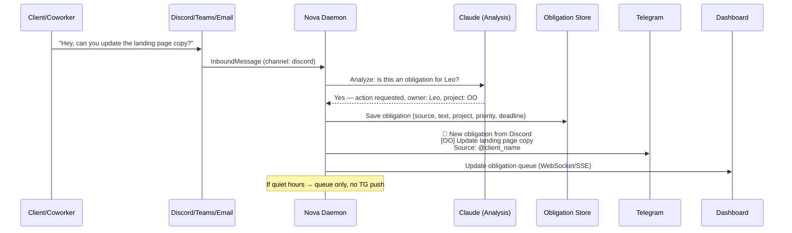
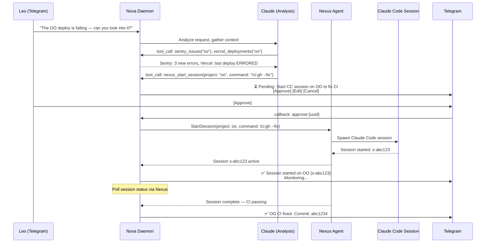
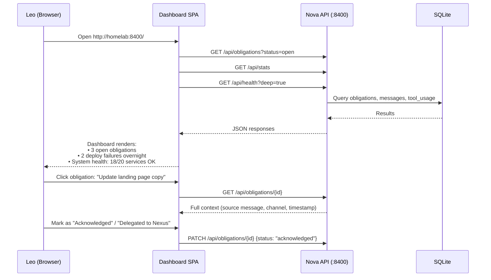
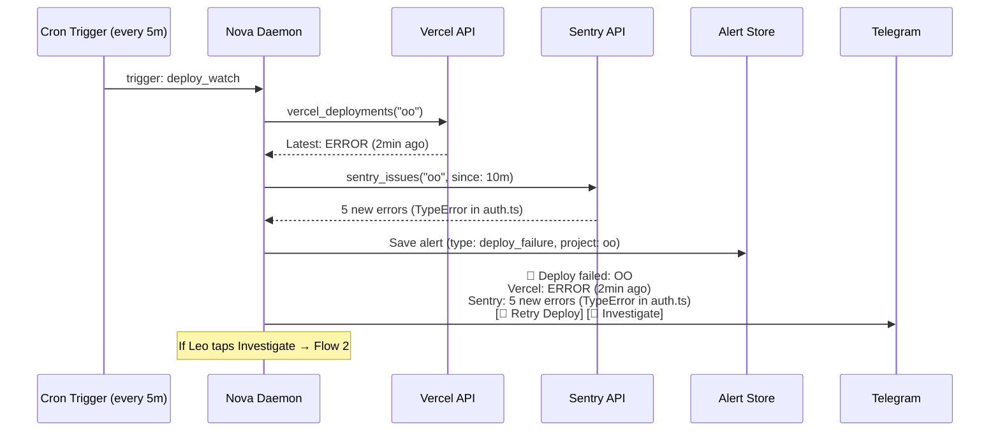
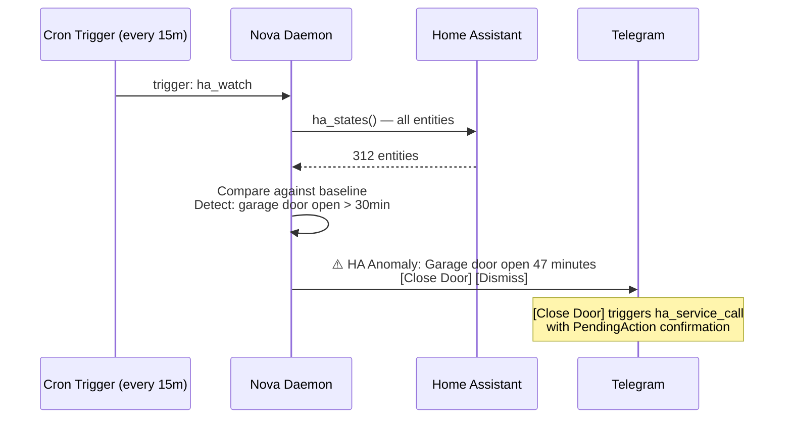

# User Stories — Nova v4

## Personas

Nova has one user (Leo) but three distinct interaction modes that create different UX needs.
Each persona represents Leo in a different context.

### Persona 1: Leo — Mobile Operator
- **Role**: DevOps lead checking in between meetings, on the go
- **Interface**: Telegram on iPhone
- **Goals**:
  - See what needs attention in <10 seconds (obligations, alerts, failures)
  - Approve or reject pending actions with one tap
  - Ask quick cross-system questions ("what's the status of OO deploy?")
- **Pain Points**:
  - Telegram output is sometimes too verbose for mobile
  - Confirmation buttons don't always surface properly
  - No way to see "what did I miss?" at a glance
- **Technical Comfort**: Power user

### Persona 2: Leo — Desktop Commander
- **Role**: Engineer at his desk, managing projects, reviewing code
- **Interface**: Web dashboard + CLI
- **Goals**:
  - See full system health across all 20+ projects on one screen
  - Drill into specific project health (deploys, errors, tickets)
  - Delegate code changes to Nexus agents and monitor progress
  - Review obligation queue and mark items as handled
- **Pain Points**:
  - Switching between Jira, Vercel, Sentry, GitHub, ADO tabs constantly
  - No unified view of "what's broken across all projects?"
  - Can't see Nova's tool usage, memory, or session history
- **Technical Comfort**: Power user

### Persona 3: Leo — Sleeping / AFK
- **Role**: Not at keyboard — Nova operates autonomously
- **Interface**: None (Nova acts proactively, queues results for review)
- **Goals**:
  - Nova watches deploys, error rates, and channels while Leo is away
  - Obligations detected from incoming messages are queued, not lost
  - P0 alerts still reach Leo via Telegram push notification
  - Non-urgent items accumulate in dashboard for morning review
- **Pain Points**:
  - Currently, obligations from overnight messages are lost (no detection)
  - Digest is sometimes empty even when things happened
  - No "morning briefing" that says "here's what you missed"
- **Technical Comfort**: N/A (autonomous operation)

---

## User Flows

### Flow 1: Proactive Obligation Detection (Must-Do #1)

The core v4 flow — Nova detects an obligation from an incoming message across any channel
and surfaces it to Leo without being asked.

### Flow 2: Code-Aware Operations (Must-Do #2)

Leo asks Nova to investigate a codebase issue and delegate a fix to a Nexus agent.

### Flow 3: Dashboard Morning Review (Desktop Commander)

Leo opens the dashboard to review overnight activity.

### Flow 4: Deploy Failure Auto-Alert (Proactive, AFK)

Nova detects a deploy failure without being asked and alerts Leo.

### Flow 5: HA Anomaly Detection (Proactive, Home)

Nova detects unusual Home Assistant state and alerts.

---

## Page Inventory

Pages derived from user flows, mapped to wireframe files.

| Flow | Screen | Wireframe |
|------|--------|-----------|
| All | Navigation hub | `index.html` |
| Flow 3 | System overview | `pages/dashboard.html` |
| Flow 1,3 | Obligation queue | `pages/obligations.html` |
| Flow 2,4 | Project detail | `pages/project.html` |
| Flow 2 | Nexus sessions | `pages/sessions.html` |
| Flow 4,5 | Alerts & events | `pages/alerts.html` |
| All | Settings / config | `pages/settings.html` |
